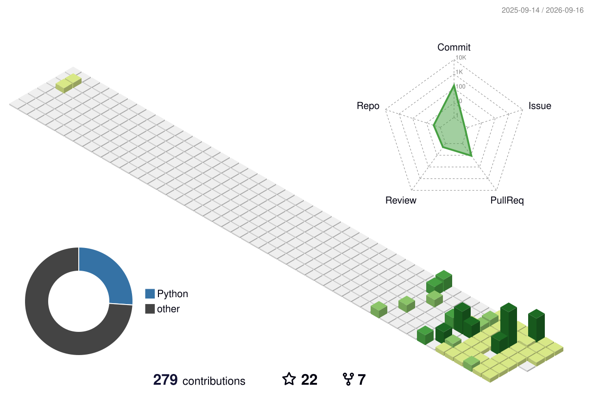

#  Hi, I'm Ritesh  Patil! 
### **Lead / Senior AI Engineer @ Generative AI Center of Excellence (GenAICoE), NTT DATA**
#### 🌐 *Core Team Member & Secretary @ AI Anytime*

  
  
  

---

##  About Me

> **"I didn't choose AI. AI chose the problems I couldn't stop thinking about."**

I am an engineer who went from writing ETL pipelines to architecting systems that think. Today, I work at **NTT DATA's GenAICOE**, where I design and deliver production-grade AI products for enterprise-scale environments. Prior to this, I spent **4.5 years at Capgemini's GenAICOE** building real-world systems across Banking, Pharma, and Legal domains.

I don't just build chatbots or AI copilots. **I build complete products.** From architecture and data pipelines to cloud infra, APIs, AI orchestration, deployment, and optimization — I enjoy owning the entire lifecycle of intelligent systems.

 **Education**: M.Sc. in Data Science (AI & NLP) — **Liverpool John Moores University (LJMU), London**  
 **Recognition**: Recipient of the **"Mission Impossible Award"** & 2-Time **"Millennial of the Quarter"**  
 **Community**: Secretary at **AI Anytime** (Non-profit AI research & education community)  
 **Commute Routine**: I read research papers during commutes and constantly explore new ways of combining AI, software engineering, and cloud technologies.  

---

##  What I've Built Over The Years

🔸 **Enterprise GenAI Platforms** & AI products on AWS and Azure-native services.  
🔸 **Agentic AI & Multi-Agent Systems** that automate complex business workflows.  
🔸 **RAG, GraphRAG, and Multimodal AI** applications.  
🔸 **Intelligent Document Processing** (IDP) and enterprise knowledge systems.  
🔸 **Translation** and multilingual NLP platforms.  
🔸 **AI-Powered Code Generation** and legacy modernization solutions.  
🔸 **Resume Intelligence** and recommendation engines.  
🔸 **Knowledge Graphs** and vector-powered retrieval systems.  

---

##  Tech Stack & Capabilities

| Category | Technologies & Tooling |
| :--- | :--- |
| **AI & Bots** |                  |
| **IDEs & Editors** |         |
| **Languages** |          |
| **Frameworks** |   |
| **Frontend** |         |
| **Backend** |    |
| **Databases** |               |
| **DevOps** |    |
| **Build Tools** |      |
| **Hosting & SaaS** |   |
| **Operating Systems** |    |
| **Testing** |    |

---

##  Featured Projects

<!-- RECENT_REPOS_START -->

  
  
  
  

<!-- RECENT_REPOS_END -->

  👉 <b>Explore all my public repositories: <a href="https://github.com/RiteshGenAI?tab=repositories">github.com/RiteshGenAI</a></b>

---

##  GitHub Analytics & Insights

  &1785741118 alt="Ritesh's GitHub Stats" />

  &1785741118 alt="Top Languages / Most Used Stack" />

<!-- STREAK_START -->

  

<!-- STREAK_END -->

##  GitHub Data

<!-- GITHUB_DATA_START -->

  

  

  

<!-- GITHUB_DATA_END -->

---

##  Let's Connect & Collaborate!

> **"For me, GenAI isn't about chasing the latest model release. It's about engineering systems that are scalable, reliable, secure, and capable of delivering measurable business value in production."**

> **"Because at the end of the day, nobody remembers which model you used. They remember the product that worked 😉✌️"**

*   💬 Ask me about: **LLMs, RAG, Prompt Engineering, Agentic Workflows, and Cloud Architecture**
*   📫 How to reach me: Connect on [LinkedIn](https://www.linkedin.com/in/ritesh-patil-39a1031a6) or drop me an email!

> **"Learning never stops until you die."** — *and I intend to keep that promise.*

(<i>Last updated: July 2026</i>)

